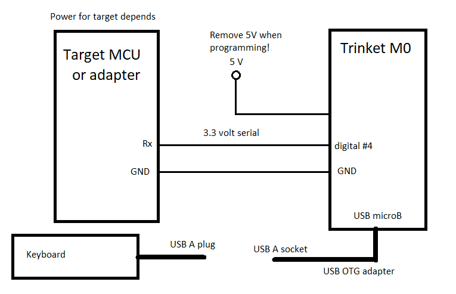
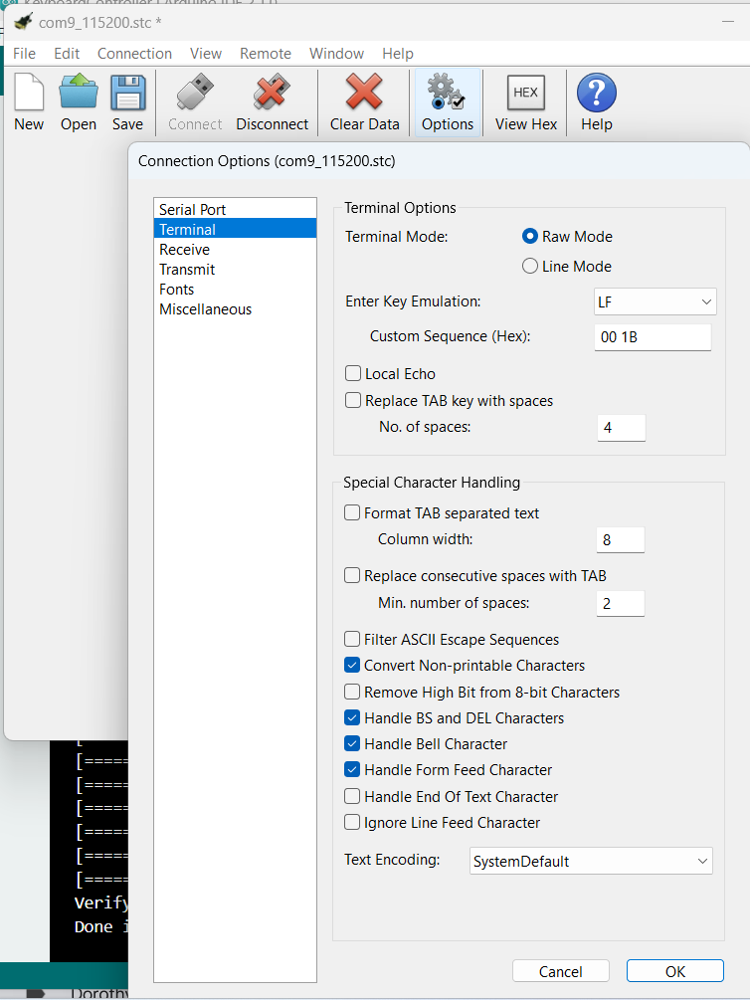
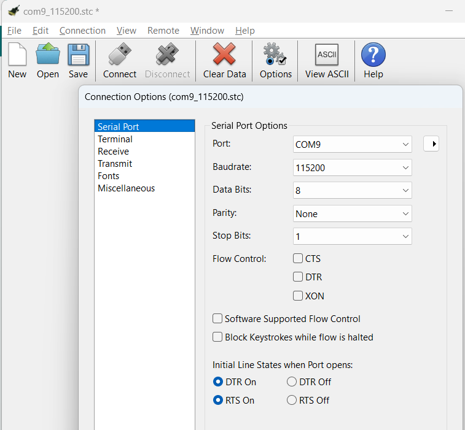

# Keyboard Controller

The Trinket M0 has a USB port that can be configured as an On-The-Go port (OTG). This example code
operates hosts a USB keyboard.

## Required Library

My fork of the Library

* https://github.com/danpeirce/USB_Host_Library_SAMD

Note there are multiple examples in the library of different types of USB host code.  

## Trinket M0 Wiring

To connect a keyboard to the Trinket M0 a OTG adapter cable is required.   I used the following

* [one vendor Digikey.ca](https://www.digikey.ca/en/products/detail/adafruit-industries-llc/1099/5875794)
* [Adafruit PDF](https://media.digikey.com/pdf/Data%20Sheets/Adafruit%20PDFs/1099_Web.pdf)

For testing a [USB to serial adapter](https://www.solarbotics.com/product/39240/) was used. The adapter was set for 3.3 volt operation. The intended 
end use for this project would be to add a keyboard to some MCU that is not acting as a USB host and so in that case Tx (Trinket pin digital #4) 
would connect to the Rx pin of a UART on the other device.

   

### Voltage Warnings

* The IO connections of the Trinket M0 operate at 3.3 volts and are __not__
  tolerant of higher voltages.
* It is permissible and necessary to supply the board with 5 volts for the board and for 
  the target keyboard when the keyboard is to be attached. This 5 volt source should be removed when programming the board via the USB connector.
  
### Reference on Wiring

See 
[https://learn.adafruit.com/adafruit-trinket-m0-circuitpython-arduino/pinouts](https://learn.adafruit.com/adafruit-trinket-m0-circuitpython-arduino/pinouts)

## Code Changes from Original Example 

The original example code was very verbose. It displayed strings for each key press and key release. It also displayed scan codes in addition to the 
original printable character. That was useful for indicating the information the Trinket M0 was receiving but not what I was looking for.
The code has been changed by commenting out statements for much of the verbose information. For this project I'm interested in the printable 
characters and not the key releases. Many non-printable keys have a NULL for the character. Those were arrow keys and function keys. I changed the code
so that NULL characters would be followed by the scan codes. Everything else would just have the ASCII code. The one exception was the window
key which in combination with other keys prints "L-Cmd " followed by the relevant ASCII code. I'm considering changes to this in future versions.

## Messages on Power Up

On power up and keyboard attachment a number of messages are sent. This may also change in future versions.

## Terminal Options

For testing I used a Terminal program. CoolTerm was chosen because it has convenient connect and disconnect tools as well as both ASCII and HEX modes.

In the Terminal Options dialogue the following settings were used:

 

The virtual serial port designated will be port system dependent.

